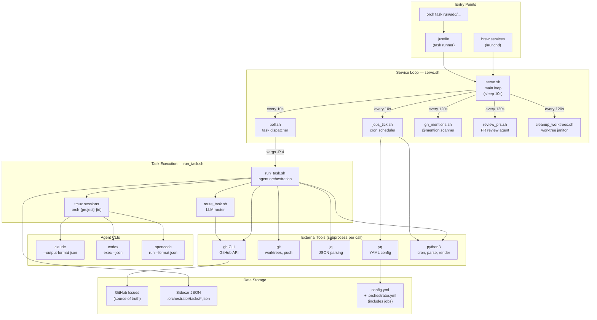
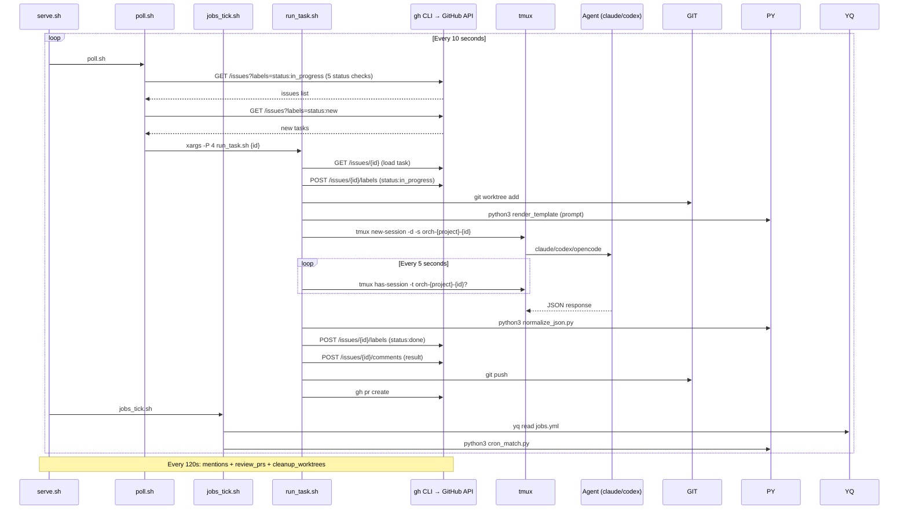
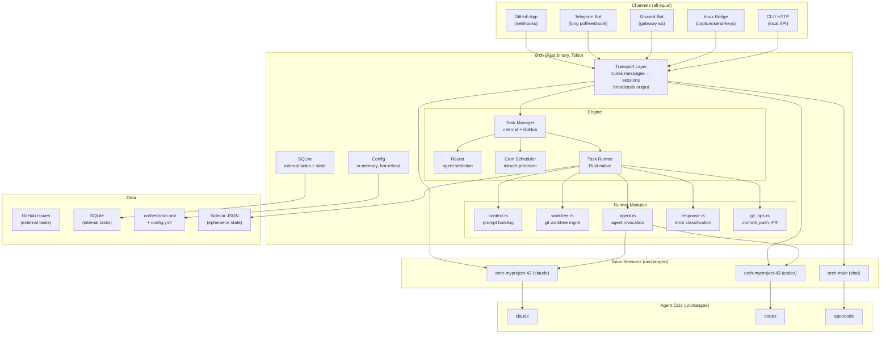

# Orch v1 — The Agent Orchestrator

> Communicate with your agents from anywhere — Discord, Telegram, GitHub, or direct tmux attach.

## Table of Contents

1. [Current Architecture (v0)](#current-architecture-v0)
2. [What's Wrong with v0](#whats-wrong-with-v0)
3. [Future Architecture (v1)](#future-architecture-v1)
4. [What Stays in Bash](#what-stays-in-bash)
5. [What Moves to Rust](#what-moves-to-rust)
6. [Internal vs GitHub Tasks](#internal-vs-github-tasks)
7. [Measurable Improvements](#measurable-improvements)
8. [Is It Worth the Move?](#is-it-worth-the-move)
9. [Stabilize v0 First](#stabilize-v0-first)
10. [Implementation Phases](#implementation-phases)
11. [Module Structure](#module-structure)
12. [Data Flow Examples](#data-flow-examples)
13. [Brew Upgrade Path](#brew-upgrade-path)
14. [Name Change: orchestrator → orch](#name-change)

---

## Current Architecture (v0)



### Current Process Flow Per Tick



### Task Lifecycle (Status Flow)

```
new → routed → in_progress → in_review → done
                    ↑              │
                    └──────────────┘
                  (changes requested)
```

| Transition | Owner | Location | Trigger |
|---|---|---|---|
| new → routed | engine tick | `engine/mod.rs` | LLM router assigns agent + complexity |
| routed → in_progress | engine dispatch | `engine/mod.rs` | Agent spawned in tmux |
| in_progress → in_review | runner | `runner/mod.rs` | Agent completes + PR exists |
| in_progress → done | runner | `runner/mod.rs` | Agent completes, no PR created |
| in_review → done | sync tick | `engine/mod.rs` (review_open_prs / auto_merge) | PR approved + merged |
| in_review → routed | sync tick | `engine/mod.rs` (review_open_prs) | Changes requested → re-dispatch (resets `review_started`) |

**Review agent**: triggered by engine when runner completes with `in_review`. Guarded by `review_started=true` sidecar flag to prevent duplicates. Reset on re-dispatch.

**Key invariant**: `done` means task is finished (PR merged or no code changes). `in_review` means PR exists and awaits review. The runner decides: if agent said "done" AND a PR exists → `in_review`; otherwise → agent's reported status.

### Subprocess Cost Per Tick (Measured)

| Operation | Subprocesses | Tools |
|-----------|-------------|-------|
| Status checks (5 statuses) | 5 | `gh` |
| Normalize new issues | 1 | `gh` |
| Config reads | ~10 | `yq` |
| Cron matching (4 jobs) | 4-8 | `python3` |
| **Quiet tick total** | **~25** | |
| | | |
| Per active task (run_task) | ~30 | `gh`, `git`, `python3`, `jq` |
| Per 120s sync window | ~10 per project | `gh`, `git` |
| **Busy tick (4 tasks)** | **~150+** | |

---

## What's Wrong with v0

### Bug Classes We've Hit

| Bug | Root Cause | Bash-Specific? |
|-----|-----------|----------------|
| Mention handler infinite loop (#265) | No dedup — 73 branches, 60+ junk issues | Fragile text matching |
| `with_lock()` shadowing `status` var | `local status=0` clobbered exported var | Yes — bash scoping |
| `db_load_task` multiline body truncation | `read -r` stops at newlines | Yes — bash IFS handling |
| Self-destructing auto-update job | `orchestrator restart` SIGTERMs own parent | Process management |
| Stale `active_task_id` blocking jobs | Manual YAML state → no automatic cleanup | YAML as database |
| Comment spam / duplicate comments | Race condition in timestamp comparison | Subprocess timing |
| 88 orphaned branches | No cleanup for stuck/failed tasks | Missing lifecycle mgmt |
| Label sprawl | No validation, agents create arbitrary labels | Late-added validation |

**At least 4 of these are bash-specific** (variable scoping, IFS parsing, fragile subprocess coordination). The rest are architectural and would exist in any language.

### Performance Bottlenecks

| Issue | Impact | Fix in Rust? |
|-------|--------|-------------|
| 25+ subprocess forks per quiet tick | ~200ms overhead, adds up | Yes — native JSON/YAML/cron |
| `yq` called ~10x per tick for config | 10 forks for config reads | Yes — in-memory config |
| `python3` for cron/parse/render | 4-8 forks per tick | Yes — native cron/parser |
| `gh` CLI startup time (~150ms each) | 5+ calls just for status checks | Yes — direct HTTP with connection pooling |
| 10s polling loop (sleep in bash) | Tasks wait up to 10s to start | Yes — async event loop |
| Sequential label operations | 3-5 API calls per status change | Yes — batch API calls |

### Capability Gaps

| Gap | Why Bash Can't | Rust Can |
|-----|---------------|----------|
| Webhooks (GitHub App) | Can't run HTTP server | axum |
| Telegram/Discord bots | Can't maintain websocket | tokio |
| Output streaming | Polling tmux capture-pane | Async broadcast channels |
| Concurrent I/O | `xargs -P` is crude | tokio::spawn |
| Internal tasks | No local DB without sqlite3 deps | Built-in SQLite (rusqlite) |
| Graceful shutdown | Trap-based, fragile | tokio signal handlers |

---

## Future Architecture (v1)



### Core Concepts

**Channel** — Bidirectional async interface. Receives messages, sends updates, streams output. All channels implement the same trait. The engine is channel-agnostic.

**Transport** — The multiplexer. Maps channel threads to tmux sessions. Telegram reply → tmux send-keys. Agent output → broadcast to all connected channels.

**Engine** — Task lifecycle, routing, scheduling. Publishes events. Doesn't know about channels.

**tmux Bridge** — Both a channel (users can "attach" from Telegram/Discord) and the execution backend. Captures pane output, pushes through transport.

### Live Session Streaming & Interaction

Today, agent sessions are black boxes — `claude -p --output-format json` runs silently in tmux and dumps JSON at the end. No visibility until it finishes.

In v1, the tmux bridge changes this completely:

**Watch** — The bridge runs `tmux capture-pane -t orch-{id} -p` every few seconds, diffs against the last capture, and streams new content through the transport to all connected channels. You see every step the agent takes — file reads, tool calls, code edits — in real-time on Telegram, Discord, or a local CLI stream.

**Join** — From any channel, attach to a running session. The transport routes your message via `tmux send-keys -t orch-{id}` directly to the agent. Type a correction, answer a question, or give new instructions — the agent sees it as input immediately.

**Intervene** — Mid-run course corrections. "Use postgres not mysql", "skip the tests for now", "focus on the API first". The agent adjusts without restarting. This turns every agent session from a fire-and-forget job into an interactive collaboration.

**Multi-viewer** — Multiple people can watch/interact with the same session simultaneously. The transport broadcasts output to every connected channel thread. One person watches on Telegram, another on Discord, a third via `orch task stream 301` in their terminal.

```
┌─────────────┐     ┌─────────────┐     ┌─────────────┐
│  Telegram    │     │  Discord    │     │  CLI        │
│  thread #42  │     │  thread #42 │     │  orch task  │
│              │     │             │     │  stream 42  │
└──────┬───────┘     └──────┬──────┘     └──────┬──────┘
       │                    │                    │
       ▼                    ▼                    ▼
┌─────────────────────────────────────────────────────┐
│                    Transport                         │
│                                                      │
│  capture-pane (every 2s) ──→ diff ──→ broadcast      │
│  user input ──→ send-keys ──→ tmux session           │
└──────────────────────┬───────────────────────────────┘
                       │
                       ▼
              ┌─────────────────┐
              │  tmux:orch-*-42 │
              │  (claude agent) │
              └─────────────────┘
```

**v0 workaround:** You can already attach to any session with `TMUX= tmux attach-session -t orch-{project}-{id}` and interact directly — it's just not connected to external channels yet.

---

## What Stays in Bash

> **Update (v1):** Almost everything originally planned to stay in bash has been ported to Rust.
> The only remaining bash dependency is the shell scripts generated at runtime for tmux sessions
> (agents need a real terminal environment).

| Component | Status | Notes |
|-----------|--------|-------|
| ~~`run_task.sh`~~ | **Ported to Rust** | `src/engine/runner/` — context, worktree, agent, response, git_ops |
| ~~Git operations~~ | **Ported to Rust** | `src/engine/runner/git_ops.rs` — auto-commit, push, PR creation via `tokio::process::Command` |
| ~~`gh pr create/merge`~~ | **Ported to Rust** | `git_ops::create_pr_if_needed()` via `gh` CLI subprocess |
| Agent invocation | **Hybrid** | Rust builds the command, generates a runner script, tmux executes it |
| ~~`justfile`~~ | **Deleted** | All recipes ported to native `orch` CLI subcommands |
| Prompt templates | **Unchanged** | Markdown files in `prompts/`, rendered by Rust `template.rs` |
| Config | **Consolidated** | Per-project `.orch.yml` + `~/.orch/config.yml` global (see [Config Architecture](#config-architecture)) |

**Principle:** Rust owns the entire lifecycle. The only bash left is the thin runner scripts that tmux executes (agents need a real TTY). All orchestration logic, git operations, and API calls are native Rust.

---

## What Moves to Rust

| Component | v0 (bash) | v1 (Rust) | Status |
|-----------|-----------|-----------|--------|
| Service loop | `serve.sh` (sleep 10s) | Tokio event loop | **Done** |
| Task polling | `poll.sh` (5x gh CLI calls) | `gh api` + `serde` parsing | **Done** |
| Config loading | `yq` subprocess per read | In-memory struct, hot-reload | **Done** |
| Cron matching | `python3 cron_match.py` | Native `cron` crate | **Done** |
| JSON parsing | `jq` subprocesses | `serde_json` | **Done** |
| Response normalization | `python3 normalize_json.py` | Native parser | **Done** |
| GitHub API calls | `gh` CLI + `jq` parsing | `gh` CLI + `serde` parsing | **Done** |
| Task execution | `run_task.sh` (bash) | `src/engine/runner/` (Rust) | **Done** |
| Git operations | bash `git` + `gh pr` | `runner/git_ops.rs` | **Done** |
| Agent invocation | bash script | `runner/agent.rs` | **Done** |
| Mention detection | `gh_mentions.sh` (polling) | Rust polling (webhook future) | **Done** (polling) |
| PR review trigger | `review_prs.sh` (polling) | Rust polling (webhook future) | **Done** (polling) |
| Sidecar I/O | `jq` read/write | Direct file I/O | **Done** |
| Template rendering | `python3 render_template()` | Native Rust | **Done** |
| Internal task DB | Not supported | `rusqlite` (embedded SQLite) | **Done** |
| CLI entry point | `justfile` (34+ recipes) | Native `clap` subcommands | **Done** |

### Total Subprocess Savings

| Scenario | v0 (subprocesses/tick) | v1 (subprocesses/tick) | Savings |
|----------|----------------------|----------------------|---------|
| Quiet tick (no tasks) | ~25 | ~2 (git status check) | **92%** |
| Per active task | ~30 | ~5 (git + agent CLI) | **83%** |
| Busy tick (4 tasks) | ~150+ | ~22 | **85%** |

---

## Internal vs GitHub Tasks

### The Problem

Not every task needs a GitHub issue:
- **Cron jobs** (morning review, evening retro) → creates clutter on the issue tracker
- **Mention response tasks** → caused 73 junk branches and 60+ issues from the loop bug
- **Internal maintenance** (cleanup, retry, reroute) → noise in the project board
- **Quick one-off tasks** (via Telegram/Discord) → don't need the overhead of an issue

### The Solution: Two Layers — External Backend Trait + Internal SQLite

```
┌───────────────────────────────────────────────────────┐
│                    Task Manager                       │
│                                                       │
│  ┌─────────────────────────────────┐  ┌────────────┐ │
│  │       ExternalBackend trait     │  │  Internal   │ │
│  │                                 │  │  (SQLite)   │ │
│  │  ┌──────────┐  ┌────────────┐  │  │             │ │
│  │  │  GitHub   │  │  Linear /  │  │  │ • Cron jobs │ │
│  │  │  Issues   │  │  Jira /    │  │  │ • Mentions  │ │
│  │  │          │  │  GitLab    │  │  │ • Maintenance│ │
│  │  │ (v1)     │  │  (later)   │  │  │ • Quick     │ │
│  │  └──────────┘  └────────────┘  │  │             │ │
│  └────────────────┬────────────────┘  └──────┬──────┘ │
│                   │                          │        │
│                   └────────────┬─────────────┘        │
│                                │                      │
│                    Same lifecycle:                     │
│                    new → routed → in_progress          │
│                    → done/blocked/needs_review         │
│                                                       │
│                    Same agent interface                │
│                    Same tmux sessions                  │
│                    Same routing                        │
└───────────────────────────────────────────────────────┘
```

### ExternalBackend Trait

GitHub Issues is just the first implementation. The trait is designed so Linear, Jira, GitLab, or any issue tracker can be swapped in later.

```rust
#[async_trait]
trait ExternalBackend: Send + Sync {
    /// Human-readable name (e.g. "github", "linear", "jira")
    fn name(&self) -> &str;

    /// Create a task in the external system, return its external ID
    async fn create_task(&self, title: &str, body: &str, labels: &[String]) -> Result<ExternalId>;

    /// Fetch a task by its external ID
    async fn get_task(&self, id: &ExternalId) -> Result<ExternalTask>;

    /// Update task status (maps to labels, states, or columns depending on backend)
    async fn update_status(&self, id: &ExternalId, status: Status) -> Result<()>;

    /// List tasks by status
    async fn list_by_status(&self, status: Status) -> Result<Vec<ExternalTask>>;

    /// Post a comment / activity note
    async fn post_comment(&self, id: &ExternalId, body: &str) -> Result<()>;

    /// Set metadata labels / tags
    async fn set_labels(&self, id: &ExternalId, labels: &[String]) -> Result<()>;

    /// Remove a label / tag
    async fn remove_label(&self, id: &ExternalId, label: &str) -> Result<()>;

    /// Check if connected and authenticated
    async fn health_check(&self) -> Result<()>;
}
```

**Implementation mapping:**

| Trait Method | GitHub Issues | Linear | Jira |
|-------------|---------------|--------|------|
| `create_task` | `gh api repos/O/R/issues` | `issueCreate` mutation | `POST /issue` |
| `update_status` | `gh api` label swap | State change | Transition |
| `list_by_status` | `gh api repos/O/R/issues?labels=` | `issues(filter:)` query | JQL search |
| `post_comment` | `gh api repos/O/R/issues/N/comments` | `commentCreate` | `POST /comment` |
| `set_labels` | `gh api repos/O/R/issues/N/labels` | `issueAddLabel` | Tag update |

### GitHub Backend: `gh` CLI, not raw HTTP

The GitHub backend shells out to `gh api` rather than using `reqwest` directly. Reasons:

1. **Auth is free** — `gh` handles OAuth, tokens, SSH keys, SSO. No JWT/App setup needed.
2. **Everyone has it** — any user with `gh` installed can use orch immediately.
3. **Rate limit handling** — `gh` has built-in retry/backoff for 429s.
4. **Less code** — no token refresh, no auth middleware, no credential storage.

The Rust side handles structured I/O: builds the `gh api` command args, parses JSON output via `serde`. No `jq` needed — Rust deserializes directly.

```rust
impl ExternalBackend for GitHubBackend {
    async fn create_task(&self, title: &str, body: &str, labels: &[String]) -> Result<ExternalId> {
        let mut cmd = Command::new("gh");
        cmd.args(["api", &format!("repos/{}/issues", self.repo), "-X", "POST"]);
        cmd.args(["-f", &format!("title={title}"), "-f", &format!("body={body}")]);
        for label in labels {
            cmd.args(["-f", &format!("labels[]={label}")]);
        }
        let output = cmd.output().await?;
        let issue: GitHubIssue = serde_json::from_slice(&output.stdout)?;
        Ok(ExternalId(issue.number.to_string()))
    }
    // ...
}
```

**Future backends** (Linear, Jira) would use `reqwest` directly since they don't have equivalent CLIs. The trait doesn't prescribe HTTP vs CLI — each backend picks what works best.

### Rules

- `type: external` → delegates to whichever `ExternalBackend` is configured (GitHub by default)
- `type: internal` → SQLite only, no external system, no branch, no PR
- Cron jobs default to `internal` unless `external: true` is set
- User can promote internal → external: `orch task publish {id}`
- External tasks are the source of truth in their backend (no bidirectional sync)
- Internal tasks live only in SQLite

**No bidirectional sync complexity.** External backends own their tasks. Internal tasks are local. They share the same engine but different storage backends.

---

## Measurable Improvements

### Performance (quantified)

| Metric | v0 (bash) | v1 (Rust) | Improvement |
|--------|-----------|-----------|-------------|
| Tick latency (quiet) | ~500ms (25 forks × ~20ms) | ~10ms (no forks) | **50x faster** |
| Tick latency (busy, 4 tasks) | ~3s (150+ forks) | ~100ms | **30x faster** |
| Config read | ~20ms (yq fork) | ~0.1ms (in-memory) | **200x faster** |
| GitHub API call | ~300ms (gh startup + HTTP) | ~100ms (pooled HTTP) | **3x faster** |
| Cron matching | ~50ms (python3 fork) | ~0.01ms (native) | **5000x faster** |
| Memory (service) | ~8MB (bash) + subprocess churn | ~15MB (steady, no churn) | Stable footprint |
| Task detection time | 0-10s (polling) | <100ms (webhooks) | **~100x faster** |
| Mention detection | 0-120s (polling) | <1s (webhook) | **~120x faster** |

### Reliability (bug classes eliminated)

| Bug Class | v0 Risk | v1 Fix |
|-----------|---------|--------|
| Variable scoping (`local` shadows) | High — caused 2 critical bugs | Rust compiler prevents this |
| IFS/read multiline parsing | High — caused data corruption | `serde` structured parsing |
| Race conditions (file state) | Medium — timestamp races | In-memory state + atomic ops |
| Subprocess coordination | Medium — SIGTERM cascades | Tokio task management |
| YAML as database | Medium — stale state | SQLite transactions |
| Missing error handling | Medium — `|| true` hides failures | `Result<T>` forces handling |

### New Capabilities Unlocked

| Capability | Value |
|------------|-------|
| GitHub App with webhooks | Instant event processing, no polling |
| Telegram bot | Manage agents from phone |
| Discord bot | Team-wide agent management |
| Output streaming | Watch agent work in real-time from any channel |
| Internal tasks | No issue clutter for maintenance work |
| Connection pooling | Fewer API calls, better rate limit management |
| Concurrent task management | True async, not `xargs -P` |
| Graceful shutdown | Clean session handoff, no orphaned processes |

---

## Is It Worth the Move?

### The Honest Assessment

**YES, but incrementally.** Here's the breakdown:

#### What You Get

1. **Multi-channel communication** — this is the killer feature. Telegram, Discord, GitHub all equal. Can't do this in bash.
2. **Internal tasks** — eliminates the biggest source of GitHub issue clutter (73 junk issues from one bug).
3. **Webhooks replace polling** — 120s mention detection → instant. This alone justifies the effort.
4. **~85% fewer subprocesses** — less CPU churn, faster response, more predictable behavior.
5. **Compiler-enforced correctness** — the variable scoping bug, the multiline parsing bug, the subprocess race conditions — Rust's type system prevents entire categories of these.

#### What It Costs

1. **~2-4 weeks** of development for Phase 1 (foundation + engine).
2. **Two codebases** to maintain during transition (Rust core + bash scripts).
3. **Learning curve** for contributors (Rust vs bash).
4. **Binary distribution** — need cross-compile CI pipeline.

#### The Kill Shot: Do Nothing vs. Do Something

**If you stay pure bash:**
- No Telegram/Discord channels (can't run websockets/webhooks)
- Keep hitting bash-specific bugs (scoping, IFS, subprocess races)
- Keep polling GitHub every 120s instead of instant webhooks
- Keep creating GitHub issues for internal tasks
- Performance stays at ~25 forks/tick

**If you add Rust core:**
- All channels become possible
- Eliminate entire bug classes
- Instant event processing
- Internal tasks for internal work
- ~2 forks/tick on quiet ticks

**Verdict:** The multi-channel vision alone makes it worth it. The reliability and performance gains are bonuses. The key is doing it incrementally — Phase 1 replaces internal tools, Phase 2 replaces the service loop, channels come after. Bash keeps working throughout.

---

## Stabilize v0 First

Before any Rust work, the current bash version needs to be rock-solid. This gives us:

1. **Baseline metrics** — measure current tick latency, API calls, error rates
2. **Bug discovery** — find all the edge cases before encoding them in Rust
3. **Test coverage** — the 259 bats tests are the contract the Rust version must match
4. **Operational confidence** — if v0 runs clean for 2 weeks, we know the design is right

### Known Issues to Fix

- [x] Mention handler infinite loop (#265) — fixed
- [x] Auto-update job SIGTERM — fixed (backgrounded restart)
- [x] 88 orphaned branches — cleaned up (96 deleted)
- [x] Stale job `active_task_id` — fixed
- [x] PR #190 owner slash commands — merged (in orchestrator repo)
- [x] PR #191 auto-reroute on usage limits — merged (in orchestrator repo)
- [x] README is outdated — refreshed (#70)
- [x] Internal tasks design — implemented (SQLite + engine integration)
- [x] Weighted round-robin for agent routing — PR #94 merged
- [x] Worktree cleanup for stuck/failed tasks — implemented in sync_tick

### Metrics to Collect Before v1

| Metric | How to Measure |
|--------|---------------|
| Tick latency | Timestamp start/end in serve.sh |
| API calls per tick | Count `gh_api` invocations |
| Error rate | grep error logs |
| Task completion time | history timestamps |
| Agent success rate | done vs needs_review ratio |
| Subprocess count | strace/dtrace per tick |

---

## Implementation Phases

### Phase 0: Stabilize v0 ✅ DONE
- [x] Fix all known bugs
- [x] Run clean for 2+ weeks
- [x] Collect baseline metrics
- [x] Grow test suite to cover all edge cases
- [x] Update README — refreshed (#70)

### Phase 1: Foundation (replace internal tools) ✅ DONE

**Goal:** Single Rust binary (`orch`) that replaces jq/python3/yq calls.

- [x] Config loading (config.yml, .orchestrator.yml) — `src/config.rs` (hot-reload via `notify`)
- [x] Sidecar JSON I/O (read/write/merge) — `src/sidecar.rs`
- [x] GitHub API client (gh CLI wrapper with serde parsing) — `src/github/cli.rs`, `src/github/types.rs`
- [ ] GitHub App auth (JWT, token refresh, GH_TOKEN export) — using `gh` CLI auth instead
- [x] Agent response parser — `src/parser.rs`
- [x] Cron matcher — `src/cron.rs`
- [x] Template renderer — `src/template.rs`
- [x] CLI: `orch config`, `orch sidecar`, `orch parse`, `orch cron`, `orch template`, `orch stream`

### Phase 2: Engine (replace serve.sh/poll.sh) ✅ MOSTLY DONE

**Goal:** Tokio event loop replaces the bash 10s tick loop.

- [x] ExternalBackend trait — `src/backends/mod.rs` (Status, ExternalTask, ExternalId)
- [x] GitHub backend — `src/backends/github.rs` (implements ExternalBackend via `gh api`)
- [x] Engine main loop — `src/engine/mod.rs` (tokio::select! with 10s tick + 120s sync)
- [x] Task polling (GitHub API via gh CLI + serde) — Phase 3 of tick()
- [x] Task runner — `src/engine/runner/` (context, worktree, agent, response, git_ops)
- [x] Stuck task recovery — Phase 2 of tick()
- [x] Parent/child unblocking — Phase 4 of tick()
- [x] Job scheduler (native cron with catch-up) — `src/engine/jobs.rs`
- [x] Internal task SQLite database — `src/db.rs` (schema, CRUD, migrations)
- [x] Internal task API — `src/engine/internal_tasks.rs`
- [x] TaskManager (unified internal + external) — `src/engine/tasks.rs`
- [x] Agent router (label-based, round-robin, LLM classification) — `src/engine/router.rs`
- [x] Router wired into engine dispatch loop (Phase 3a route → Phase 3b dispatch)
- [x] tmux bridge (capture-pane, send-keys, session lifecycle) — `src/tmux.rs`
- [x] Output capture service (2s polling loop) — `src/channels/capture.rs`
- [x] Transport layer (pub/sub broadcast) — `src/channels/transport.rs`
- [x] Graceful shutdown (SIGTERM/SIGINT handlers)
- [x] CLI: `orch serve`
- [x] Sync tick: cleanup done worktrees — `cleanup_done_worktrees()` in Rust
- [x] Sync tick: check merged PRs — `check_merged_prs()` in Rust
- [x] Sync tick: scan @mentions — `scan_mentions()` in Rust
- [x] Sync tick: review open PRs — `review_open_prs()` in Rust
- [x] Task CRUD CLI commands — `orch task list/add/get/publish`
- [x] Security module — `src/security.rs`
- [x] **Rewrite run_task.sh in Rust** — `src/engine/runner/` (context, worktree, agent, response, git_ops)
- [x] **Route task in Rust** — router wired into dispatch loop, `run_with_context()` calls runner
- [x] Multi-project support — PR #82 merged
- [x] Config hot-reload wired into engine — PR #78 merged

### Phase 3: Channels (scaffolding done, not wired)

**Goal:** Multi-channel I/O for task management and live streaming.

- [x] Channel trait + ChannelRegistry — `src/channels/mod.rs` (scaffolding)
- [x] Transport layer — `src/channels/transport.rs` (session bindings, broadcast)
- [x] Tmux channel — `src/channels/tmux.rs` (pane monitoring)
- [x] Capture service — `src/channels/capture.rs` (output diffing + streaming)
- [x] GitHub channel (polling implementation) — PR #81 merged
- [x] Telegram channel (long-poll implementation) — PR #81 merged
- [x] Discord channel (polling implementation) — PR #81 merged
- [x] Webhook HTTP server (axum) — PR #93 merged
- [x] Wire webhook server into engine — PR #123 merged
- [ ] Mention detection via webhooks (#112)
- [x] Polling fallback when webhooks not configured — PR #131 merged
- [x] Wire channels into engine event loop — PR #81 merged

### Phase 4: CLI & User-Facing Commands

**Goal:** Replace justfile → bash script routing with native `orch` CLI.

- [x] `orch serve` — start engine
- [x] `orch config <key>` — read config
- [x] `orch sidecar get/set` — task metadata
- [x] `orch parse <path>` — parse agent response
- [x] `orch cron <expr>` — cron matching
- [x] `orch template <path>` — render templates
- [x] `orch stream <id>` — live output streaming
- [x] `orch task list/add/get/publish` — task CRUD
- [x] `orch task status` — task status overview
- [x] `orch task route <id>` — route task to agent
- [x] `orch task run <id>` — execute task
- [x] `orch task retry <id>` — retry failed task
- [x] `orch task attach <id>` — attach to tmux session
- [x] `orch task kill <id>` — kill agent session
- [x] `orch task live` — list active sessions
- [x] `orch task unblock <id|all>` — unblock tasks
- [x] `orch job list/add/remove/enable/disable/tick` — job management
- [x] `orch init` — project initialization
- [x] `orch agents` — list available agent CLIs
- [x] `orch version` — show version info
- [x] `orch log` — tail logs
- [x] `orch service start/stop/restart/status` — service management
- [x] `orch completions <shell>` — shell completions
- [x] `orch board list/link/sync/info` — GitHub Projects V2 board management
- [ ] `orch project add/remove/list` — multi-project management
- [x] Rename binary from `orch-core` to `orch`
- [x] Absorb justfile routing into native CLI (justfile deleted)

### Phase 5: Polish & Migration

- [x] Rename `~/.orchestrator/` → `~/.orch/` (with backward compat) — PR #83
- [x] Rename `.orchestrator.yml` → `.orch.yml` — issue #74
- [x] Update brew formula (from `orchestrator` to `orch`) — `Formula/orch.rb`
- [x] Update AGENTS.md with Rust engine docs
- [x] Jobs config consolidated into `.orchestrator.yml` (no separate `jobs.yml`)
- [x] Cross-compile CI pipeline (macOS arm64 + x86_64) — PR #92 merged
- [x] Metrics / observability (tracing, prometheus) — PR #95 merged
- [x] Unified notification system (events → all channels) — PR #124 merged
- [x] Per-agent runner trait (AgentRunner, AgentError, per-agent parsers) — PR #116 merged
- [x] Agent memory (persist learnings across retries) — PR #122 merged
- [x] PR review integration (parse review comments → follow-up tasks) — PR #125 merged
- [x] Self-improvement loop (auto-create issues from metrics) — PR #120 merged
- [x] Polling fallback for webhooks (health check, fallback mode) — PR #131 merged
- [x] Updated default model map to current identifiers — PR #130 merged
- [x] Auto-clone GitHub repos during `orch init` — PR #141 merged
- [x] Separate `~/.orch/` from `~/.orchestrator/` (real directory, no symlink)
- [x] Project-aware tmux session naming (`orch-{project}-{id}`)
- [x] Simplified service management (pure `brew services` wrapper)
- [x] Permission rules per-agent translation (PermissionRules → native CLI flags)

### Phase 6: Remaining Gaps

**Goal:** Close remaining feature gaps with bash orchestrator.

- [ ] `orch project add/remove/list` — multi-project management CLI
- [ ] Wire Telegram/Discord channels into engine event loop
- [ ] Mention detection via webhooks (#112)
- [ ] Owner commands (feedback via issue comments: `/retry`, `/reroute`)
- [ ] Merge detection (auto-close after PR merge)
- [ ] Dashboard/reporting CLI command
- [ ] Graceful shutdown with session handoff
- [ ] Slack channel integration
- [ ] Context file per issue (persistent context accumulation)

---

## Module Structure

```
src/
├── main.rs                  # CLI entrypoint (clap) + all subcommand dispatch
├── config/
│   └── mod.rs               # Config loading (.orch.yml + ~/.orch/config.yml, multi-project)
│
├── cli/
│   ├── mod.rs               # CLI utilities (agents, init, log, version)
│   ├── task.rs              # Task subcommand handlers
│   ├── job.rs               # Job subcommand handlers
│   └── service.rs           # Service management (start/stop/restart/status)
│
├── backends/
│   ├── mod.rs               # ExternalBackend trait, ExternalTask, ExternalId, Status
│   └── github.rs            # GitHub Issues implementation (via `gh api`)
│
├── channels/
│   ├── mod.rs               # Channel trait, IncomingMessage, OutgoingMessage
│   ├── transport.rs         # Session bindings, routing, output broadcast
│   ├── capture.rs           # tmux output capture + diffing service
│   ├── notification.rs      # Unified notification dispatch (levels, formatting, broadcast)
│   ├── tmux.rs              # tmux channel (pane monitoring)
│   ├── github.rs            # GitHub App: webhooks (stub)
│   ├── telegram.rs          # Telegram Bot API (stub)
│   └── discord.rs           # Discord gateway websocket (stub)
│
├── engine/
│   ├── mod.rs               # Engine struct, event loop (10s tick + 120s sync), PR review integration
│   ├── tasks.rs             # TaskManager — unified internal + external CRUD
│   ├── internal_tasks.rs    # Internal task SQLite operations
│   ├── router.rs            # Agent routing (label, round-robin, LLM, circuit breaker)
│   ├── jobs.rs              # Cron scheduler + self-review job (metrics → improvement issues)
│   └── runner/
│       ├── mod.rs           # TaskRunner — orchestrates full task lifecycle
│       ├── context.rs       # Prompt context building (project instructions, repo tree, etc.)
│       ├── worktree.rs      # Git worktree creation, branch naming, reuse
│       ├── agent.rs         # Agent invocation + prompt building
│       ├── agents/
│       │   ├── mod.rs       # AgentRunner trait, AgentError enum, PermissionRules, pattern detection
│       │   ├── claude.rs    # Claude/Kimi/MiniMax runner (JSON envelope parser)
│       │   ├── codex.rs     # Codex runner (NDJSON stream parser)
│       │   └── opencode.rs  # OpenCode runner (NDJSON parser + free model discovery)
│       ├── response.rs      # Failover logic, cooldowns, weight signals, memory storage
│       └── git_ops.rs       # Auto-commit, push, PR creation, PR override detection
│
├── github/
│   ├── mod.rs               # GitHub helpers (shared by backend + channel)
│   ├── cli.rs               # `gh api` wrapper — structured args in, serde out
│   ├── types.rs             # GitHubIssue, GitHubComment, GitHubLabel, etc.
│   └── projects.rs          # GitHub Projects V2 GraphQL operations
│
├── db.rs                    # SQLite for internal tasks (schema + migrations)
├── sidecar.rs               # JSON sidecar file I/O + agent memory persistence
├── parser.rs                # Agent response normalization (JSON → AgentResponse)
├── template.rs              # Template rendering (env var substitution)
├── tmux.rs                  # TmuxManager (session create/kill/list/capture)
├── security.rs              # Secret scanning + redaction
├── home.rs                  # Home directory resolution (~/.orch/)
└── cron.rs                  # Native cron expression matching
```

---

## Feature Documentation

### Agent Memory System

**Location:** `src/sidecar.rs` (memory storage), `src/engine/runner/response.rs` (write), `src/engine/runner/context.rs` (read)

Agents persist learnings across retries so subsequent attempts don't repeat the same mistakes. Memory entries are stored in the task's sidecar JSON file (`~/.orch/state/{task_id}.json`) under the `"memory"` key.

**`MemoryEntry` structure:**

| Field | Type | Description |
|-------|------|-------------|
| `attempt` | `u32` | 1-indexed attempt number |
| `agent` | `String` | Agent that made the attempt |
| `model` | `Option<String>` | Model used |
| `learnings` | `Vec<String>` | Key learnings from the attempt |
| `error` | `Option<String>` | Error message if failed |
| `files_modified` | `Vec<String>` | Files changed |
| `approach` | `String` | Approach taken (from summary) |
| `timestamp` | `String` | ISO 8601 formatted |

**How it works:**

1. After each attempt, `store_memory()` or `store_failure_memory()` writes a `MemoryEntry` to the sidecar.
2. On retry, `build_memory_context()` in `context.rs` fetches the most recent entries and formats them as a markdown section in the agent prompt.
3. Max **3 entries** per task (`MAX_MEMORY_ENTRIES = 3`) to prevent context overflow.

### Notification System

**Location:** `src/channels/notification.rs`

Unified notification dispatch that broadcasts task completion events to all configured channels (Telegram, Discord). Notifications are filtered by a configurable level.

**Configuration:**

| Key | Values | Default | Description |
|-----|--------|---------|-------------|
| `notifications.level` | `all`, `errors_only`, `none` | `all` | Controls which events trigger notifications |

**`NotificationLevel` behavior:**

| Level | Notifies on |
|-------|------------|
| `all` | All task completions (done, in_review, needs_review, blocked, failed) |
| `errors_only` | Only `needs_review`, `blocked`, `failed` |
| `none` | Disabled entirely |

**`TaskNotification` fields:** `task_id`, `title`, `status`, `summary`, `agent`, `duration_seconds`

**Formatting:** Channel-specific formatters (`format_telegram()`, `format_discord()`) with status emoji mapping (✅ done, ⚠️ needs_review, 🚫 blocked, ❌ failed, etc.).

**Integration:** The notification dispatcher is spawned in the engine loop. After task completion, a notification is pushed, filtered by level, formatted per channel, and broadcast via the transport layer. GitHub notifications are handled separately (comments), and tmux is skipped.

### PR Review Integration

**Location:** `src/engine/mod.rs` (`review_open_prs()`)

Automatically creates follow-up tasks when a PR receives a `CHANGES_REQUESTED` review. This closes the feedback loop between code review and agent execution.

**How it works:**

1. During the 120s sync tick, `review_open_prs()` lists all tasks with `Status::InReview`.
2. For each task, fetches PR reviews via the GitHub CLI.
3. Filters for `CHANGES_REQUESTED` reviews with actionable comments (non-empty, non-reply).
4. Creates internal follow-up tasks with these labels:
   - `pr-review-followup`
   - `status:new`
   - `agent:{original_agent}` — routes to the same agent that created the PR
5. Each follow-up task's sidecar stores: `pr_number`, `branch`, `reviewer`, `file_path`, `parent_task_id`.

**Deduplication:** Uses `review_comment_{pr_number}_{comment_id}` as a key to prevent duplicate follow-up tasks for the same review comment.

### Self-Review Job

**Location:** `src/engine/jobs.rs` (`run_self_review()`)

A scheduled job that analyzes task metrics and auto-creates GitHub issues for orchestrator improvements. Detects patterns of failure, recurring errors, and slow execution.

**Job type:** `self-review`

**Detection patterns:**

| Pattern | Function | What it detects |
|---------|----------|----------------|
| High failure rate agents | `detect_high_failure_agent()` | Agents with disproportionately high failure rates |
| Recurring errors | `detect_common_errors()` | Error patterns appearing across multiple tasks |
| Slow tasks | `detect_slow_tasks()` | Tasks taking significantly longer than average |

**Rate limiting:** Max **3 self-improvement issues per 7-day** rolling window (`MAX_SELF_IMPROVEMENT_ISSUES_PER_WEEK = 3`). Checked via `db.count_self_improvement_issues_7d()` before creating new issues.

**Metrics sources:**

| Source | Window | Purpose |
|--------|--------|---------|
| `get_metrics_summary_24h()` | 24 hours | Current performance snapshot |
| `get_slow_tasks_7d()` | 7 days | Historical execution time analysis |
| `get_error_distribution_7d()` | 7 days | Error pattern detection |

**Output:** Creates GitHub issues via `create_self_improvement_issue()` with detailed analysis and suggested fixes. Sets `job.last_task_status` to `"done"`, `"no_issues"`, or `"failed"`.

---

## Data Flow Examples

### User creates a task via Telegram

```
Telegram msg: "add a login page with OAuth"
  → TelegramChannel receives IncomingMessage
  → Transport.route() → MessageRoute::NewTask
  → Engine.create_task(title, body, type=github)
  → GitHub Issues API: POST /repos/owner/repo/issues
  → Engine.route_task() → agent=claude, complexity=medium
  → Engine.run_with_context() → Rust runner (worktree → agent → tmux session orch-myproject-42)
  → Transport.bind("42", "orch-myproject-42", "telegram", chat_id)
  → tmux bridge captures output → Transport.push_output()
  → Telegram channel streams output to chat
  → Agent finishes → runner posts result comment → all channels notified
```

### User replies to agent in Discord

```
Discord msg in task thread: "use shadcn instead of material ui"
  → DiscordChannel receives IncomingMessage
  → Transport.route() → MessageRoute::TaskSession { task_id: "42" }
  → Transport.tmux_session_for("42") → "orch-myproject-42"
  → tmux.send_keys("orch-myproject-42", "use shadcn instead of material ui\n")
  → Agent receives input, continues working
  → Output streams back to Discord thread
```

### Cron job fires (internal task)

```
Scheduler: job "morning-review" matches 08:00 UTC
  → Engine.create_task(title, body, type=internal)  ← SQLite, not GitHub
  → Engine.route_task() → agent=claude
  → Engine.run_with_context() → Rust runner (worktree → agent → tmux session orch-int-5)
  → No branch, no PR, no GitHub issue
  → Agent finishes → result stored in SQLite
  → Summary posted to Telegram (if configured)
```

### GitHub webhook: new issue

```
GitHub webhook: issues.opened
  → GitHubChannel receives IncomingMessage
  → Transport.route() → MessageRoute::NewTask
  → Engine.create_task() (already exists in GitHub, just set status:new)
  → Engine.route_task() → picks agent
  → Normal task flow (with branch + PR)
```

---

## Brew Upgrade Path

### Formula Structure (current)

```ruby
class Orch < Formula
  desc "The Agent Orchestrator"
  homepage "https://github.com/gabrielkoerich/orch"

  # Prebuilt Rust binary (cross-compiled in CI)
  if Hardware::CPU.arm?
    url "https://github.com/.../orch-aarch64-apple-darwin.tar.gz"
  else
    url "https://github.com/.../orch-x86_64-apple-darwin.tar.gz"
  end

  # No jq/yq/python3 dependencies — everything is native Rust
  depends_on "gh"  # GitHub CLI for API calls

  def install
    bin.install "orch"
    libexec.install Dir["prompts/*"]
  end

  service do
    run [opt_bin/"orch", "serve"]
    keep_alive true
    log_path var/"log/orch.log"
    error_log_path var/"log/orch.error.log"
  end
end
```

### Release Flow

```
push to main
  → CI: cargo test + cargo clippy + cargo fmt --check
  → CI: cargo build --release (macOS arm64 + x86_64)
  → CI: create universal binary (lipo)
  → CI: auto-tag (semver from conventional commits)
  → CI: GitHub release with orch binary + prompts tarball
  → CI: update homebrew-tap formula
  → brew upgrade orch
```

### Rollback

If a release has issues: `brew switch orch 0.x.y`. The binary is self-contained — no external scripts required.

---

## Name Change

| v0 | v1 |
|----|-----|
| `orchestrator` | `orch` |
| `gabrielkoerich/orchestrator` | `gabrielkoerich/orch` |
| `brew install orchestrator` | `brew install orch` |
| `orchestrator serve` | `orch serve` |
| `orchestrator task add` | `orch task add` |
| `~/.orchestrator/` | `~/.orch/` |
| `ORCH_HOME` | `ORCH_HOME` (unchanged) |
| `.orchestrator.yml` | `.orch.yml` (with backward compat) |

All renames are complete. Binary (`orch-core` → `orch`), directory (`~/.orchestrator/` → `~/.orch/` as separate real directory), and config (`.orchestrator.yml` → `.orch.yml`) are all done. The two tools (`orchestrator` and `orch`) run fully independently with separate home dirs, tmux sessions, and config.

---

## Config Architecture

### Design

Two layers: **global defaults** + **per-project overrides**.

**Global config: `~/.orch/config.yml`** — shared defaults and project registry.

```yaml
# Project registry — list of local paths
# Each path must contain a .orch.yml with gh.repo
projects:
  - /Users/gb/Projects/orch
  - /Users/gb/Projects/my-other-project

# Shared defaults (apply to all projects unless overridden)
workflow:
  auto_close: true
  review_owner: "@owner"
  max_attempts: 10
  timeout_seconds: 1800

router:
  mode: "round_robin"
  timeout_seconds: 60
  fallback_executor: "minimax"
  allowed_tools: [yq, jq, bash, just, git, rg, ...]

model_map:
  simple: { claude: haiku, codex: gpt-5.1-codex-mini }
  medium: { claude: opus, codex: gpt-5.2 }
  complex: { claude: opus, codex: gpt-5.3-codex }

agents:
  claude: { allowed_tools: [...] }
  opencode: { permission: {...}, models: [...] }

git:
  name: "orchestrator[bot]"
  email: "orchestrator@orchestrator.bot"
```

**Per-project config: `{project_path}/.orch.yml`** — project-specific settings.

```yaml
# REQUIRED — identifies this project on GitHub
gh:
  repo: "owner/repo"
  project_id: "PVT_..."           # optional: GitHub Projects V2
  project_status_field_id: "..."   # optional
  project_status_map: { ... }      # optional

# Optional overrides (merge on top of global defaults)
workflow:
  auto_close: false

router:
  fallback_executor: "codex"

required_tools:
  - cargo

# Per-project scheduled jobs
jobs:
  - id: code-review
    schedule: "0 4,17 * * *"
    task: { title: "Code review", body: "...", labels: [review] }
    enabled: true
```

### Resolution order

1. Read `projects:` from `~/.orch/config.yml` → list of paths
2. For each path, read `{path}/.orch.yml` → get `gh.repo`, overrides, jobs
3. Per-project values override global defaults for the same key
4. CLI commands resolve project from CWD (find nearest `.orch.yml` walking up)

### What was removed

| Old key | Where it was | Replacement |
|---------|-------------|-------------|
| `project_dir` (global) | `~/.orch/config.yml` | `projects:` list (paths) |
| `gh.repo` (global) | `~/.orch/config.yml` | Per-project `.orch.yml` |
| `projects.yml` | `~/.orch/projects.yml` | `projects:` in `config.yml` |
| `repo` (top-level) | `~/.orch/config.yml` | Per-project `gh.repo` |

### CLI naming

| Command | Purpose |
|---------|---------|
| `orch project add <path>` | Register a project path in global config |
| `orch project remove <path>` | Unregister a project from global config |
| `orch project list` | List all registered projects with repo + status |
| `orch board list/link/sync/info` | GitHub Projects V2 board management |
| `orch init` | Initialize `.orch.yml` in current directory |

Note: `orch board` manages GitHub Projects V2 boards. `orch project` manages the multi-project registry in global config.

---

## Parity Audit — Feature Gaps

Last updated: 2026-02-26 (276 tests, ~90% parity)

### Completed

| Feature | Module | PR |
|---------|--------|----|
| GitHub Projects V2 integration | `src/github/projects.rs` | — |
| Per-task artifact folders (per-repo, per-attempt) | `src/home.rs`, `src/engine/runner/` | — |
| Per-repo state isolation | `~/.orch/state/{owner}/{repo}/tasks/{id}/` | — |
| Config architecture (multi-project) | `src/config/mod.rs` | PR #82, #78 |
| `orch board list/link/sync/info` CLI | `src/cli/mod.rs` | — |
| Project board auto-sync on status change | `src/backends/github.rs` | — |
| Auto-clone repos during `orch init` | `src/cli/mod.rs` | PR #141 |
| Separate `~/.orch/` from `~/.orchestrator/` | `src/home.rs` | — |
| Project-aware tmux naming (`orch-{project}-{id}`) | `src/tmux.rs`, `src/engine/mod.rs` | — |
| Simplified service management (brew wrapper) | `src/cli/service.rs` | — |
| Permission rules per-agent translation | `src/engine/runner/agents/` | — |
| PR review integration | `src/engine/mod.rs` | PR #125 |
| Agent memory across retries | `src/sidecar.rs` | PR #122 |
| Self-improvement loop | `src/engine/jobs.rs` | PR #120 |
| Polling fallback for webhooks | `src/channels/github.rs` | PR #131 |

### Remaining Gaps

| Feature | Status | Priority | Notes |
|---------|--------|----------|-------|
| `orch project add/remove/list` CLI | Implemented | Done | See `src/cli/mod.rs:475-710` |
| Wire Telegram/Discord into engine loop | Implemented | Done | See `src/channels/telegram.rs`, `src/channels/discord.rs`, `src/engine/mod.rs:251-296` |
| Mention detection via webhooks | Implemented | Done | Polling works, webhook receives events via `start_webhook_server()` in `src/channels/github.rs` |
| Review Agent + Auto-Merge | Implemented | Done | See `src/engine/mod.rs:1768-2100+` `review_and_merge()` function |
| PR Review Comments → Fix Dispatch | Implemented | Done | See `src/engine/mod.rs:1469-1700+` `review_open_prs()` function |
| Dashboard CLI | Implemented | Done | See `src/cli/dashboard.rs` - `orch dashboard` command |
| Task Tree CLI | Implemented | Done | See `src/cli/tree.rs` - `orch task tree` command |
| Owner commands (issue comment commands) | Planned | Medium | Issue #179 - slash commands like `/retry`, `/reroute`, `/block` |
| Child task delegation (auto-spawn subtasks) | Parser done, engine missing | High | Issue #178 - parser supports `delegations` field but engine doesn't process them |
| Skills Sync (auto-clone skill repos) | Missing | Low | Config exists but no sync implementation |
| Merge detection (auto-close after PR merge) | Missing | Medium | Detect PR merge and auto-close associated issue |
| Graceful shutdown with session handoff | Partial | Low | SIGTERM handling exists but session handoff incomplete |
| Slack channel integration | Missing | Low | Future channel addition |
| Context file per issue | Implemented | Done | See `src/engine/runner/context.rs:40-45` `load_task_context()` |

### Config Architecture

Redesigned from single-global to multi-project:
- Global `~/.orch/config.yml`: shared defaults + `projects:` list of local paths
- Per-project `.orch.yml`: `gh.repo`, jobs, project-specific overrides
- No more `project_dir`, `gh.repo`, or `projects.yml` at global level
- CLI resolves project context from CWD

### GitHub Projects V2

The old orchestrator had 4 dedicated scripts for project board management. `orch` now has:
- `ProjectSync` struct with GraphQL operations (discover fields, add items, update status)
- Automatic project board column sync when task status changes (non-fatal)
- CLI: `orch board list`, `orch board link <id>`, `orch board sync`, `orch board info`
- Config stored in per-project `.orch.yml` under `gh.project_id`, `gh.project_status_field_id`, `gh.project_status_map`

### Per-Task Artifact Folders

Old layout (flat): `~/.orch/state/prompt-42-sys.txt`, `runner-42.sh`, etc.

New layout (per-repo, per-task, per-attempt):
```
~/.orch/state/{owner}/{repo}/tasks/{id}/
  sidecar.json
  attempts/
    1/
      prompt-sys.md
      prompt-msg.md
      runner.sh
      exit.txt
      stderr.txt
      output.json
    2/  (retry)
      ...
```

Benefits: per-repo isolation (no issue number collisions), per-attempt separation (retries don't overwrite), easy cleanup. Legacy flat paths still work as fallback for reads.

---

## Key Dependencies

| Crate | Purpose | Status |
|-------|---------|--------|
| `tokio` | Async runtime | In use |
| `serde` / `serde_json` / `serde_yml` | Serialization | In use |
| `clap` / `clap_complete` | CLI parsing + shell completions | In use |
| `chrono` | Timestamps | In use |
| `tracing` / `tracing-subscriber` | Structured logging | In use |
| `anyhow` / `thiserror` | Error handling | In use |
| `sha2` | Hashing (dedup) | In use |
| `cron` | Cron expressions | In use |
| `rusqlite` | Internal task SQLite DB | In use |
| `reqwest` | HTTP client | In use |
| `regex` | Secret/leak detection | In use |
| `notify` | Config file watching | In use |
| `which` | Agent CLI discovery | In use |
| `futures` | Async combinators | In use |
| `dirs` | XDG directory helpers | In use |
| `async-trait` | Async trait support | In use |
| `urlencoding` | URL encoding for labels | In use |
| `axum` | Webhook HTTP server | In use |
| `teloxide` | Telegram bot | Future (Phase 3) |
| `serenity` | Discord bot | Future (Phase 3) |

---

## TODO — Remaining Work

### Open Issues

| Issue | Title | Priority | Description |
|-------|-------|----------|-------------|
| #178 | Implement task delegation processing in engine | High | Parser supports `delegations` field but engine doesn't process them to create child tasks. See `src/parser.rs` (Delegation struct), `src/engine/mod.rs` (add process_delegations()). |
| #179 | Implement owner slash commands for GitHub issue comments | Medium | Add `/retry`, `/reroute [agent]`, `/block [reason]`, `/unblock`, `/close`, `/review` commands for repo owners to control tasks from GitHub. |
| #143 | PR Review Integration — Auto-create follow-up tasks | Medium | Process `changes_requested` reviews and auto-create sub-tasks with review context. Partially implemented in `src/engine/mod.rs:review_open_prs()`. |
| #144 | Cost Tracking CLI and Budget Enforcement | Medium | Add `orch cost <task_id>` command, aggregate cost reporting, and visible budget warnings. See src/sidecar.rs (cost tracking), src/cli/mod.rs (add command). |
| #145 | Webhook Server Production Hardening | Medium | Graceful shutdown coordination, webhook event persistence, retry logic with backoff. See src/channels/github.rs (webhook server), src/engine/mod.rs (lifecycle). |

### Recently Completed

| Issue | Title | Description |
|-------|-------|-------------|
| - | Review Agent + Auto-Merge | `review_and_merge()` in `src/engine/mod.rs:1768+` - spawns review agent after task completion, handles approve/request_changes |
| - | PR Review Comments → Fix Dispatch | `review_open_prs()` in `src/engine/mod.rs:1469+` - monitors PR reviews and re-dispatches tasks with review context |
| - | Dashboard CLI | `orch dashboard` command in `src/cli/dashboard.rs` - shows task counts, active sessions, recent activity |
| - | Task Tree CLI | `orch task tree` command in `src/cli/tree.rs` - ASCII tree of parent-child task relationships |

### Implementation Notes

**Issue #143 - PR Review Integration:**
- Location: `src/engine/mod.rs` (add handler in `process_message()`)
- Detect review state and create follow-up tasks as sub-issues
- Update task status appropriately when reviews are submitted

**Issue #144 - Cost Tracking:**
- Location: `src/cli/mod.rs` (new subcommand), `src/db.rs` (cost metrics)
- Build on existing cost estimation in `src/sidecar.rs:208-260`
- Add budget warnings at 80% threshold with GitHub comment posting

**Issue #145 - Webhook Hardening:**
- Location: `src/channels/github.rs` (shutdown signal handling)
- Add graceful shutdown with engine lifecycle
- Implement webhook delivery persistence table
- Add retry queue for failed webhook processing

### Documentation Updates Needed

- [ ] Update `AGENTS.md` with PR review integration flow
- [ ] Document `orch cost` command when implemented
- [ ] Document webhook server configuration options
- [ ] Update feature checklist in this PLAN.md as issues are closed
