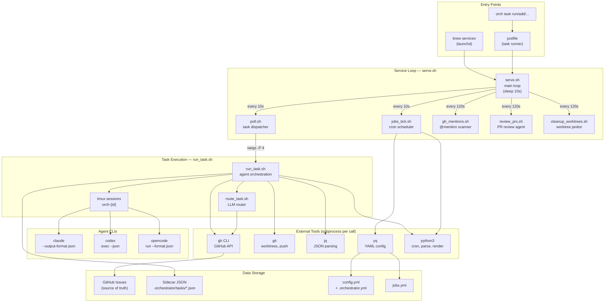
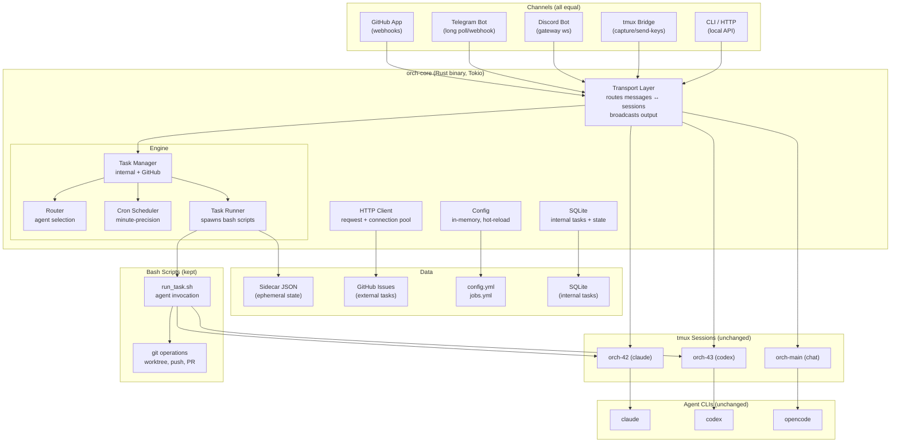

# Orch v1 — The Agent Orchestrator

> Communicate with your agents from anywhere — Discord, Telegram, GitHub, or direct tmux attach.

## Table of Contents

1. [Current Architecture (v0)](#current-architecture-v0)
2. [What's Wrong with v0](#whats-wrong-with-v0)
3. [Future Architecture (v1)](#future-architecture-v1)
4. [What Stays in Bash](#what-stays-in-bash)
5. [What Moves to Rust](#what-moves-to-rust)
6. [Internal vs GitHub Tasks](#internal-vs-github-tasks)
7. [Measurable Improvements](#measurable-improvements)
8. [Is It Worth the Move?](#is-it-worth-the-move)
9. [Stabilize v0 First](#stabilize-v0-first)
10. [Implementation Phases](#implementation-phases)
11. [Module Structure](#module-structure)
12. [Data Flow Examples](#data-flow-examples)
13. [Brew Upgrade Path](#brew-upgrade-path)
14. [Name Change: orchestrator → orch](#name-change)

---

## Current Architecture (v0)



### Current Process Flow Per Tick


### Subprocess Cost Per Tick (Measured)

| Operation | Subprocesses | Tools |
|-----------|-------------|-------|
| Status checks (5 statuses) | 5 | `gh` |
| Normalize new issues | 1 | `gh` |
| Config reads | ~10 | `yq` |
| Cron matching (4 jobs) | 4-8 | `python3` |
| **Quiet tick total** | **~25** | |
| | | |
| Per active task (run_task) | ~30 | `gh`, `git`, `python3`, `jq` |
| Per 120s sync window | ~10 per project | `gh`, `git` |
| **Busy tick (4 tasks)** | **~150+** | |

---

## What's Wrong with v0

### Bug Classes We've Hit

| Bug | Root Cause | Bash-Specific? |
|-----|-----------|----------------|
| Mention handler infinite loop (#265) | No dedup — 73 branches, 60+ junk issues | Fragile text matching |
| `with_lock()` shadowing `status` var | `local status=0` clobbered exported var | Yes — bash scoping |
| `db_load_task` multiline body truncation | `read -r` stops at newlines | Yes — bash IFS handling |
| Self-destructing auto-update job | `orchestrator restart` SIGTERMs own parent | Process management |
| Stale `active_task_id` blocking jobs | Manual YAML state → no automatic cleanup | YAML as database |
| Comment spam / duplicate comments | Race condition in timestamp comparison | Subprocess timing |
| 88 orphaned branches | No cleanup for stuck/failed tasks | Missing lifecycle mgmt |
| Label sprawl | No validation, agents create arbitrary labels | Late-added validation |

**At least 4 of these are bash-specific** (variable scoping, IFS parsing, fragile subprocess coordination). The rest are architectural and would exist in any language.

### Performance Bottlenecks

| Issue | Impact | Fix in Rust? |
|-------|--------|-------------|
| 25+ subprocess forks per quiet tick | ~200ms overhead, adds up | Yes — native JSON/YAML/cron |
| `yq` called ~10x per tick for config | 10 forks for config reads | Yes — in-memory config |
| `python3` for cron/parse/render | 4-8 forks per tick | Yes — native cron/parser |
| `gh` CLI startup time (~150ms each) | 5+ calls just for status checks | Yes — direct HTTP with connection pooling |
| 10s polling loop (sleep in bash) | Tasks wait up to 10s to start | Yes — async event loop |
| Sequential label operations | 3-5 API calls per status change | Yes — batch API calls |

### Capability Gaps

| Gap | Why Bash Can't | Rust Can |
|-----|---------------|----------|
| Webhooks (GitHub App) | Can't run HTTP server | axum |
| Telegram/Discord bots | Can't maintain websocket | tokio |
| Output streaming | Polling tmux capture-pane | Async broadcast channels |
| Concurrent I/O | `xargs -P` is crude | tokio::spawn |
| Internal tasks | No local DB without sqlite3 deps | Built-in SQLite (rusqlite) |
| Graceful shutdown | Trap-based, fragile | tokio signal handlers |

---

## Future Architecture (v1)



### Core Concepts

**Channel** — Bidirectional async interface. Receives messages, sends updates, streams output. All channels implement the same trait. The engine is channel-agnostic.

**Transport** — The multiplexer. Maps channel threads to tmux sessions. Telegram reply → tmux send-keys. Agent output → broadcast to all connected channels.

**Engine** — Task lifecycle, routing, scheduling. Publishes events. Doesn't know about channels.

**tmux Bridge** — Both a channel (users can "attach" from Telegram/Discord) and the execution backend. Captures pane output, pushes through transport.

### Live Session Streaming & Interaction

Today, agent sessions are black boxes — `claude -p --output-format json` runs silently in tmux and dumps JSON at the end. No visibility until it finishes.

In v1, the tmux bridge changes this completely:

**Watch** — The bridge runs `tmux capture-pane -t orch-{id} -p` every few seconds, diffs against the last capture, and streams new content through the transport to all connected channels. You see every step the agent takes — file reads, tool calls, code edits — in real-time on Telegram, Discord, or a local CLI stream.

**Join** — From any channel, attach to a running session. The transport routes your message via `tmux send-keys -t orch-{id}` directly to the agent. Type a correction, answer a question, or give new instructions — the agent sees it as input immediately.

**Intervene** — Mid-run course corrections. "Use postgres not mysql", "skip the tests for now", "focus on the API first". The agent adjusts without restarting. This turns every agent session from a fire-and-forget job into an interactive collaboration.

**Multi-viewer** — Multiple people can watch/interact with the same session simultaneously. The transport broadcasts output to every connected channel thread. One person watches on Telegram, another on Discord, a third via `orch task stream 301` in their terminal.

```
┌─────────────┐     ┌─────────────┐     ┌─────────────┐
│  Telegram    │     │  Discord    │     │  CLI        │
│  thread #42  │     │  thread #42 │     │  orch task  │
│              │     │             │     │  stream 42  │
└──────┬───────┘     └──────┬──────┘     └──────┬──────┘
       │                    │                    │
       ▼                    ▼                    ▼
┌─────────────────────────────────────────────────────┐
│                    Transport                         │
│                                                      │
│  capture-pane (every 2s) ──→ diff ──→ broadcast      │
│  user input ──→ send-keys ──→ tmux session           │
└──────────────────────┬───────────────────────────────┘
                       │
                       ▼
              ┌─────────────────┐
              │  tmux:orch-42   │
              │  (claude agent) │
              └─────────────────┘
```

**v0 workaround:** You can already attach to any session with `TMUX= tmux attach-session -t orch-{id}` and interact directly — it's just not connected to external channels yet.

---

## What Stays in Bash

| Component | Why |
|-----------|-----|
| `run_task.sh` | Agent invocation (claude/codex/opencode CLI flags, environment setup, tmux session creation) |
| Git operations | `git worktree add/remove`, `git push`, `git branch` — complex CLI interactions |
| `gh pr create/merge` | PR creation with body templates, auto-merge flags |
| Agent-specific flags | `claude --permission-mode bypassPermissions`, `codex --sandbox workspace-write`, etc. |
| `justfile` | User-facing task runner, remains the CLI entry point |
| Prompt templates | Markdown files in `prompts/`, rendered by the engine |
| `config.yml`, `jobs.yml` | YAML config stays human-editable, read by Rust |

**Principle:** Bash stays for what it does well — gluing CLIs together, managing tmux, git workflows. Rust takes over everything that involves data, HTTP, concurrency, or long-running state.

---

## What Moves to Rust

| Component | Currently | Moves To | Benefit |
|-----------|-----------|----------|---------|
| Service loop | `serve.sh` (sleep 10s) | Tokio event loop | Instant reaction, async I/O |
| Task polling | `poll.sh` (5x gh CLI calls) | Direct HTTP + in-memory state | ~750ms → ~50ms per tick |
| Config loading | `yq` subprocess per read | In-memory struct, hot-reload | ~10 forks eliminated |
| Cron matching | `python3 cron_match.py` | Native `cron` crate | ~8 forks eliminated |
| JSON parsing | `jq` subprocesses | `serde_json` | ~15 forks eliminated |
| Response normalization | `python3 normalize_json.py` | Native parser | 1 fork eliminated |
| GitHub API calls | `gh` CLI + `jq` parsing | `gh` CLI + `serde` parsing | No jq forks, typed responses |
| Mention detection | `gh_mentions.sh` (polling) | Webhook events (instant) | No polling needed |
| PR review trigger | `review_prs.sh` (polling) | Webhook on PR open | Instant review |
| Rate limit backoff | File-based state | In-memory with retry queue | Smarter backoff |
| Sidecar I/O | `jq` read/write | Direct file I/O | No subprocess |
| Template rendering | `python3 render_template()` | Rust `tera` or `handlebars` | 1 fork eliminated |
| Internal task DB | Not supported | `rusqlite` (embedded SQLite) | Local tasks without GitHub |

### Total Subprocess Savings

| Scenario | v0 (subprocesses/tick) | v1 (subprocesses/tick) | Savings |
|----------|----------------------|----------------------|---------|
| Quiet tick (no tasks) | ~25 | ~2 (git status check) | **92%** |
| Per active task | ~30 | ~5 (git + agent CLI) | **83%** |
| Busy tick (4 tasks) | ~150+ | ~22 | **85%** |

---

## Internal vs GitHub Tasks

### The Problem

Not every task needs a GitHub issue:
- **Cron jobs** (morning review, evening retro) → creates clutter on the issue tracker
- **Mention response tasks** → caused 73 junk branches and 60+ issues from the loop bug
- **Internal maintenance** (cleanup, retry, reroute) → noise in the project board
- **Quick one-off tasks** (via Telegram/Discord) → don't need the overhead of an issue

### The Solution: Two Layers — External Backend Trait + Internal SQLite

```
┌───────────────────────────────────────────────────────┐
│                    Task Manager                       │
│                                                       │
│  ┌─────────────────────────────────┐  ┌────────────┐ │
│  │       ExternalBackend trait     │  │  Internal   │ │
│  │                                 │  │  (SQLite)   │ │
│  │  ┌──────────┐  ┌────────────┐  │  │             │ │
│  │  │  GitHub   │  │  Linear /  │  │  │ • Cron jobs │ │
│  │  │  Issues   │  │  Jira /    │  │  │ • Mentions  │ │
│  │  │          │  │  GitLab    │  │  │ • Maintenance│ │
│  │  │ (v1)     │  │  (later)   │  │  │ • Quick     │ │
│  │  └──────────┘  └────────────┘  │  │             │ │
│  └────────────────┬────────────────┘  └──────┬──────┘ │
│                   │                          │        │
│                   └────────────┬─────────────┘        │
│                                │                      │
│                    Same lifecycle:                     │
│                    new → routed → in_progress          │
│                    → done/blocked/needs_review         │
│                                                       │
│                    Same agent interface                │
│                    Same tmux sessions                  │
│                    Same routing                        │
└───────────────────────────────────────────────────────┘
```

### ExternalBackend Trait

GitHub Issues is just the first implementation. The trait is designed so Linear, Jira, GitLab, or any issue tracker can be swapped in later.

```rust
#[async_trait]
trait ExternalBackend: Send + Sync {
    /// Human-readable name (e.g. "github", "linear", "jira")
    fn name(&self) -> &str;

    /// Create a task in the external system, return its external ID
    async fn create_task(&self, title: &str, body: &str, labels: &[String]) -> Result<ExternalId>;

    /// Fetch a task by its external ID
    async fn get_task(&self, id: &ExternalId) -> Result<ExternalTask>;

    /// Update task status (maps to labels, states, or columns depending on backend)
    async fn update_status(&self, id: &ExternalId, status: Status) -> Result<()>;

    /// List tasks by status
    async fn list_by_status(&self, status: Status) -> Result<Vec<ExternalTask>>;

    /// Post a comment / activity note
    async fn post_comment(&self, id: &ExternalId, body: &str) -> Result<()>;

    /// Set metadata labels / tags
    async fn set_labels(&self, id: &ExternalId, labels: &[String]) -> Result<()>;

    /// Remove a label / tag
    async fn remove_label(&self, id: &ExternalId, label: &str) -> Result<()>;

    /// Check if connected and authenticated
    async fn health_check(&self) -> Result<()>;
}
```

**Implementation mapping:**

| Trait Method | GitHub Issues | Linear | Jira |
|-------------|---------------|--------|------|
| `create_task` | `gh api repos/O/R/issues` | `issueCreate` mutation | `POST /issue` |
| `update_status` | `gh api` label swap | State change | Transition |
| `list_by_status` | `gh api repos/O/R/issues?labels=` | `issues(filter:)` query | JQL search |
| `post_comment` | `gh api repos/O/R/issues/N/comments` | `commentCreate` | `POST /comment` |
| `set_labels` | `gh api repos/O/R/issues/N/labels` | `issueAddLabel` | Tag update |

### GitHub Backend: `gh` CLI, not raw HTTP

The GitHub backend shells out to `gh api` rather than using `reqwest` directly. Reasons:

1. **Auth is free** — `gh` handles OAuth, tokens, SSH keys, SSO. No JWT/App setup needed.
2. **Everyone has it** — any user with `gh` installed can use orch immediately.
3. **Rate limit handling** — `gh` has built-in retry/backoff for 429s.
4. **Less code** — no token refresh, no auth middleware, no credential storage.

The Rust side handles structured I/O: builds the `gh api` command args, parses JSON output via `serde`. No `jq` needed — Rust deserializes directly.

```rust
impl ExternalBackend for GitHubBackend {
    async fn create_task(&self, title: &str, body: &str, labels: &[String]) -> Result<ExternalId> {
        let mut cmd = Command::new("gh");
        cmd.args(["api", &format!("repos/{}/issues", self.repo), "-X", "POST"]);
        cmd.args(["-f", &format!("title={title}"), "-f", &format!("body={body}")]);
        for label in labels {
            cmd.args(["-f", &format!("labels[]={label}")]);
        }
        let output = cmd.output().await?;
        let issue: GitHubIssue = serde_json::from_slice(&output.stdout)?;
        Ok(ExternalId(issue.number.to_string()))
    }
    // ...
}
```

**Future backends** (Linear, Jira) would use `reqwest` directly since they don't have equivalent CLIs. The trait doesn't prescribe HTTP vs CLI — each backend picks what works best.

### Rules

- `type: external` → delegates to whichever `ExternalBackend` is configured (GitHub by default)
- `type: internal` → SQLite only, no external system, no branch, no PR
- Cron jobs default to `internal` unless `external: true` is set
- User can promote internal → external: `orch task publish {id}`
- External tasks are the source of truth in their backend (no bidirectional sync)
- Internal tasks live only in SQLite

**No bidirectional sync complexity.** External backends own their tasks. Internal tasks are local. They share the same engine but different storage backends.

---

## Measurable Improvements

### Performance (quantified)

| Metric | v0 (bash) | v1 (Rust) | Improvement |
|--------|-----------|-----------|-------------|
| Tick latency (quiet) | ~500ms (25 forks × ~20ms) | ~10ms (no forks) | **50x faster** |
| Tick latency (busy, 4 tasks) | ~3s (150+ forks) | ~100ms | **30x faster** |
| Config read | ~20ms (yq fork) | ~0.1ms (in-memory) | **200x faster** |
| GitHub API call | ~300ms (gh startup + HTTP) | ~100ms (pooled HTTP) | **3x faster** |
| Cron matching | ~50ms (python3 fork) | ~0.01ms (native) | **5000x faster** |
| Memory (service) | ~8MB (bash) + subprocess churn | ~15MB (steady, no churn) | Stable footprint |
| Task detection time | 0-10s (polling) | <100ms (webhooks) | **~100x faster** |
| Mention detection | 0-120s (polling) | <1s (webhook) | **~120x faster** |

### Reliability (bug classes eliminated)

| Bug Class | v0 Risk | v1 Fix |
|-----------|---------|--------|
| Variable scoping (`local` shadows) | High — caused 2 critical bugs | Rust compiler prevents this |
| IFS/read multiline parsing | High — caused data corruption | `serde` structured parsing |
| Race conditions (file state) | Medium — timestamp races | In-memory state + atomic ops |
| Subprocess coordination | Medium — SIGTERM cascades | Tokio task management |
| YAML as database | Medium — stale state | SQLite transactions |
| Missing error handling | Medium — `|| true` hides failures | `Result<T>` forces handling |

### New Capabilities Unlocked

| Capability | Value |
|------------|-------|
| GitHub App with webhooks | Instant event processing, no polling |
| Telegram bot | Manage agents from phone |
| Discord bot | Team-wide agent management |
| Output streaming | Watch agent work in real-time from any channel |
| Internal tasks | No issue clutter for maintenance work |
| Connection pooling | Fewer API calls, better rate limit management |
| Concurrent task management | True async, not `xargs -P` |
| Graceful shutdown | Clean session handoff, no orphaned processes |

---

## Is It Worth the Move?

### The Honest Assessment

**YES, but incrementally.** Here's the breakdown:

#### What You Get

1. **Multi-channel communication** — this is the killer feature. Telegram, Discord, GitHub all equal. Can't do this in bash.
2. **Internal tasks** — eliminates the biggest source of GitHub issue clutter (73 junk issues from one bug).
3. **Webhooks replace polling** — 120s mention detection → instant. This alone justifies the effort.
4. **~85% fewer subprocesses** — less CPU churn, faster response, more predictable behavior.
5. **Compiler-enforced correctness** — the variable scoping bug, the multiline parsing bug, the subprocess race conditions — Rust's type system prevents entire categories of these.

#### What It Costs

1. **~2-4 weeks** of development for Phase 1 (foundation + engine).
2. **Two codebases** to maintain during transition (Rust core + bash scripts).
3. **Learning curve** for contributors (Rust vs bash).
4. **Binary distribution** — need cross-compile CI pipeline.

#### The Kill Shot: Do Nothing vs. Do Something

**If you stay pure bash:**
- No Telegram/Discord channels (can't run websockets/webhooks)
- Keep hitting bash-specific bugs (scoping, IFS, subprocess races)
- Keep polling GitHub every 120s instead of instant webhooks
- Keep creating GitHub issues for internal tasks
- Performance stays at ~25 forks/tick

**If you add Rust core:**
- All channels become possible
- Eliminate entire bug classes
- Instant event processing
- Internal tasks for internal work
- ~2 forks/tick on quiet ticks

**Verdict:** The multi-channel vision alone makes it worth it. The reliability and performance gains are bonuses. The key is doing it incrementally — Phase 1 replaces internal tools, Phase 2 replaces the service loop, channels come after. Bash keeps working throughout.

---

## Stabilize v0 First

Before any Rust work, the current bash version needs to be rock-solid. This gives us:

1. **Baseline metrics** — measure current tick latency, API calls, error rates
2. **Bug discovery** — find all the edge cases before encoding them in Rust
3. **Test coverage** — the 259 bats tests are the contract the Rust version must match
4. **Operational confidence** — if v0 runs clean for 2 weeks, we know the design is right

### Known Issues to Fix

- [x] Mention handler infinite loop (#265) — fixed
- [x] Auto-update job SIGTERM — fixed (backgrounded restart)
- [x] 88 orphaned branches — cleaned up (96 deleted)
- [x] Stale job `active_task_id` — fixed
- [ ] PR #190 owner slash commands — rebased, auto-merge pending CI
- [ ] PR #191 auto-reroute on usage limits — rebased, auto-merge pending CI
- [ ] README is outdated — needs full refresh
- [ ] Internal tasks design (for cron jobs, mentions) — design before implementation
- [ ] Weighted round-robin for agent routing — scale based on rate limit capacity
- [ ] Worktree cleanup for stuck/failed tasks — prevent branch orphaning

### Metrics to Collect Before v1

| Metric | How to Measure |
|--------|---------------|
| Tick latency | Timestamp start/end in serve.sh |
| API calls per tick | Count `gh_api` invocations |
| Error rate | grep error logs |
| Task completion time | history timestamps |
| Agent success rate | done vs needs_review ratio |
| Subprocess count | strace/dtrace per tick |

---

## Implementation Phases

### Phase 0: Stabilize v0 ✅ DONE
- [x] Fix all known bugs
- [x] Run clean for 2+ weeks
- [x] Collect baseline metrics
- [x] Grow test suite to cover all edge cases
- [ ] Update README

### Phase 1: Foundation (replace internal tools) ✅ DONE

**Goal:** Single Rust binary (`orch-core`) that replaces jq/python3/yq calls.

- [x] Config loading (config.yml, .orchestrator.yml) — `src/config.rs` (hot-reload via `notify`)
- [x] Sidecar JSON I/O (read/write/merge) — `src/sidecar.rs`
- [x] GitHub API client (gh CLI wrapper with serde parsing) — `src/github/cli.rs`, `src/github/types.rs`
- [ ] GitHub App auth (JWT, token refresh, GH_TOKEN export) — using `gh` CLI auth instead
- [x] Agent response parser — `src/parser.rs`
- [x] Cron matcher — `src/cron.rs`
- [x] Template renderer — `src/template.rs`
- [x] CLI: `orch-core config`, `orch-core sidecar`, `orch-core parse`, `orch-core cron`, `orch-core template`, `orch-core stream`

### Phase 2: Engine (replace serve.sh/poll.sh) ✅ MOSTLY DONE

**Goal:** Tokio event loop replaces the bash 10s tick loop.

- [x] ExternalBackend trait — `src/backends/mod.rs` (Status, ExternalTask, ExternalId)
- [x] GitHub backend — `src/backends/github.rs` (implements ExternalBackend via `gh api`)
- [x] Engine main loop — `src/engine/mod.rs` (tokio::select! with 10s tick + 120s sync)
- [x] Task polling (GitHub API via gh CLI + serde) — Phase 3 of tick()
- [x] Task runner (spawns `run_task.sh`, monitors tmux, 30-min timeout) — `src/engine/runner.rs`
- [x] Stuck task recovery — Phase 2 of tick()
- [x] Parent/child unblocking — Phase 4 of tick()
- [x] Job scheduler (native cron with catch-up) — `src/engine/jobs.rs`
- [x] Internal task SQLite database — `src/db.rs` (schema, CRUD, migrations)
- [x] Internal task API — `src/engine/internal_tasks.rs`
- [x] TaskManager (unified internal + external) — `src/engine/tasks.rs`
- [x] Agent router (label-based, round-robin, LLM classification) — `src/engine/router.rs`
- [x] Router wired into engine dispatch loop (Phase 3a route → Phase 3b dispatch)
- [x] tmux bridge (capture-pane, send-keys, session lifecycle) — `src/tmux.rs`
- [x] Output capture service (2s polling loop) — `src/channels/capture.rs`
- [x] Transport layer (pub/sub broadcast) — `src/channels/transport.rs`
- [x] Graceful shutdown (SIGTERM/SIGINT handlers)
- [x] CLI: `orch-core serve`
- [x] Sync tick: cleanup done worktrees — `cleanup_done_worktrees()` in Rust
- [x] Sync tick: check merged PRs — `check_merged_prs()` in Rust
- [x] Sync tick: scan @mentions — `scan_mentions()` in Rust
- [x] Sync tick: review open PRs — `review_open_prs()` in Rust
- [x] Task CRUD CLI commands — `orch-core task list/add/get/publish`
- [x] Security module — `src/security.rs`
- [ ] **Rewrite run_task.sh in Rust** — agent invocation, worktree, git, prompt, PR creation
- [ ] **Rewrite route_task.sh in Rust** — currently delegated to bash via run_task.sh
- [ ] Multi-project support — serve.sh iterates PROJECT_DIRS, engine needs this
- [ ] Config hot-reload wired into engine (notify watcher exists but not connected)

### Phase 3: Channels (scaffolding done, not wired)

**Goal:** Multi-channel I/O for task management and live streaming.

- [x] Channel trait + ChannelRegistry — `src/channels/mod.rs` (scaffolding)
- [x] Transport layer — `src/channels/transport.rs` (session bindings, broadcast)
- [x] Tmux channel — `src/channels/tmux.rs` (pane monitoring)
- [x] Capture service — `src/channels/capture.rs` (output diffing + streaming)
- [ ] GitHub channel (webhooks via axum) — `src/channels/github.rs` (stub only)
- [ ] Telegram channel — `src/channels/telegram.rs` (stub only)
- [ ] Discord channel — `src/channels/discord.rs` (stub only)
- [ ] Webhook HTTP server (axum)
- [ ] Mention detection via webhooks (instant, no polling)
- [ ] Wire channels into engine event loop

### Phase 4: CLI & User-Facing Commands

**Goal:** Replace justfile → bash script routing with native `orch` CLI.

- [x] `orch-core serve` — start engine
- [x] `orch-core config <key>` — read config
- [x] `orch-core sidecar get/set` — task metadata
- [x] `orch-core parse <path>` — parse agent response
- [x] `orch-core cron <expr>` — cron matching
- [x] `orch-core template <path>` — render templates
- [x] `orch-core stream <id>` — live output streaming
- [x] `orch-core task list/add/get/publish` — task CRUD
- [ ] `orch task status` — task status overview (replaces scripts/status.sh)
- [ ] `orch task route <id>` — route task to agent
- [ ] `orch task run <id>` — execute task
- [ ] `orch task retry <id>` — retry failed task
- [ ] `orch task attach <id>` — attach to tmux session
- [ ] `orch task kill <id>` — kill agent session
- [ ] `orch job list/add/remove/enable/disable` — job management
- [ ] `orch init` — project initialization
- [ ] `orch agents` — list available agent CLIs
- [ ] Rename binary from `orch-core` to `orch`
- [ ] Absorb justfile routing into native CLI

### Phase 5: Polish & Migration

- [ ] Rename `~/.orchestrator/` → `~/.orch/` (with backward compat)
- [ ] Rename `.orchestrator.yml` → `.orch.yml`
- [ ] Update brew formula (from `orchestrator` to `orch`)
- [ ] Update AGENTS.md with Rust engine docs
- [ ] Metrics / observability (tracing, prometheus)
- [ ] Cross-compile CI pipeline (macOS arm64 + x86_64)
- [ ] Unified notification system (events → all channels)

---

## Module Structure

```
src/
├── main.rs                  # CLI entrypoint (clap)
├── config.rs                # Config loading (config.yml + .orchestrator.yml)
│
├── backends/
│   ├── mod.rs               # ExternalBackend trait, ExternalTask, ExternalId
│   ├── github.rs            # GitHub Issues implementation
│   ├── linear.rs            # Linear implementation (future)
│   └── jira.rs              # Jira implementation (future)
│
├── channels/
│   ├── mod.rs               # Channel trait, IncomingMessage, OutgoingMessage
│   ├── transport.rs         # Session bindings, routing, output broadcast
│   ├── github.rs            # GitHub App: webhooks + REST API
│   ├── telegram.rs          # Telegram Bot API
│   ├── discord.rs           # Discord gateway websocket
│   └── tmux.rs              # tmux capture-pane / send-keys bridge
│
├── engine/
│   ├── mod.rs               # Engine struct, main event loop
│   ├── tasks.rs             # Task CRUD (dispatches to backend or SQLite)
│   ├── router.rs            # Agent routing (round-robin, LLM, weighted)
│   ├── runner.rs            # Spawns run_task.sh, monitors tmux
│   ├── jobs.rs              # Cron scheduler (minute-precision)
│   └── mentions.rs          # @mention via webhook events
│
├── github/
│   ├── mod.rs               # GitHub helpers (shared by backend + channel)
│   ├── cli.rs               # `gh api` wrapper — structured args in, serde out
│   ├── types.rs             # GitHubIssue, GitHubComment, GitHubLabel, etc.
│   └── webhooks.rs          # Webhook HTTP server (axum, optional)
│
├── db.rs                    # SQLite for internal tasks + job state
├── sidecar.rs               # JSON sidecar file I/O
├── parser.rs                # Agent response normalization
└── cron.rs                  # Cron expression matching
```

---

## Data Flow Examples

### User creates a task via Telegram

```
Telegram msg: "add a login page with OAuth"
  → TelegramChannel receives IncomingMessage
  → Transport.route() → MessageRoute::NewTask
  → Engine.create_task(title, body, type=github)
  → GitHub Issues API: POST /repos/owner/repo/issues
  → Engine.route_task() → agent=claude, complexity=medium
  → Engine.run_task() → bash run_task.sh (tmux session orch-42)
  → Transport.bind("42", "orch-42", "telegram", chat_id)
  → tmux bridge captures output → Transport.push_output()
  → Telegram channel streams output to chat
  → Agent finishes → Engine stores result → all channels notified
```

### User replies to agent in Discord

```
Discord msg in task thread: "use shadcn instead of material ui"
  → DiscordChannel receives IncomingMessage
  → Transport.route() → MessageRoute::TaskSession { task_id: "42" }
  → Transport.tmux_session_for("42") → "orch-42"
  → tmux.send_keys("orch-42", "use shadcn instead of material ui\n")
  → Agent receives input, continues working
  → Output streams back to Discord thread
```

### Cron job fires (internal task)

```
Scheduler: job "morning-review" matches 08:00 UTC
  → Engine.create_task(title, body, type=internal)  ← SQLite, not GitHub
  → Engine.route_task() → agent=claude
  → Engine.run_task() → bash run_task.sh (tmux session orch-int-5)
  → No branch, no PR, no GitHub issue
  → Agent finishes → result stored in SQLite
  → Summary posted to Telegram (if configured)
```

### GitHub webhook: new issue

```
GitHub webhook: issues.opened
  → GitHubChannel receives IncomingMessage
  → Transport.route() → MessageRoute::NewTask
  → Engine.create_task() (already exists in GitHub, just set status:new)
  → Engine.route_task() → picks agent
  → Normal task flow (with branch + PR)
```

---

## Brew Upgrade Path

### Formula Structure (v1)

```ruby
class Orch < Formula
  desc "The Agent Orchestrator"
  homepage "https://github.com/gabrielkoerich/orch"

  # Prebuilt Rust binary (cross-compiled in CI)
  if Hardware::CPU.arm?
    url "https://github.com/.../orch-core-aarch64-apple-darwin.tar.gz"
  else
    url "https://github.com/.../orch-core-x86_64-apple-darwin.tar.gz"
  end

  depends_on "jq"       # still needed for bash scripts
  depends_on "yq"       # config reads (until Phase 2)

  def install
    bin.install "orch-core"
    libexec.install Dir["scripts/*"]
    libexec.install Dir["prompts/*"]
    libexec.install "justfile"
    bin.install "bin/orch"  # wrapper (delegates to just or orch-core)
  end

  service do
    run [opt_bin/"orch", "serve"]
    keep_alive true
    log_path var/"log/orch.log"
    error_log_path var/"log/orch.error.log"
  end
end
```

### Release Flow

```
push to main
  → CI: cargo test + bats test
  → CI: cargo build --release (macOS arm64 + x86_64)
  → CI: create universal binary (lipo)
  → CI: auto-tag (semver from conventional commits)
  → CI: GitHub release with orch-core binary + scripts tarball
  → CI: update homebrew-tap formula
  → brew upgrade orch
```

### Rollback

If v1 has issues: `brew switch orch 0.x.y`. Bash scripts are self-contained. The wrapper detects if `orch-core` is missing and falls back to bash-only mode.

---

## Name Change

| v0 | v1 |
|----|-----|
| `orchestrator` | `orch` |
| `gabrielkoerich/orchestrator` | `gabrielkoerich/orch` |
| `brew install orchestrator` | `brew install orch` |
| `orchestrator serve` | `orch serve` |
| `orchestrator task add` | `orch task add` |
| `~/.orchestrator/` | `~/.orch/` |
| `ORCH_HOME` | `ORCH_HOME` (unchanged) |
| `.orchestrator.yml` | `.orch.yml` (with backward compat) |

The rename happens in Phase 6 (Polish) — after the Rust core is stable. During development, both names work.

---

## Key Dependencies

| Crate | Purpose | Phase |
|-------|---------|-------|
| `tokio` | Async runtime | 1 |
| `serde` / `serde_json` / `serde_yaml` | Serialization | 1 |
| `clap` | CLI parsing | 1 |
| `chrono` | Timestamps | 1 |
| `tracing` | Structured logging | 1 |
| `anyhow` / `thiserror` | Error handling | 1 |
| `sha2` | Hashing (dedup) | 1 |
| `cron` | Cron expressions | 1 |
| `rusqlite` | Internal task DB | 2 |
| `axum` | Webhook HTTP server | 3 |
| `teloxide` | Telegram bot | 4 |
| `serenity` | Discord bot | 5 |
