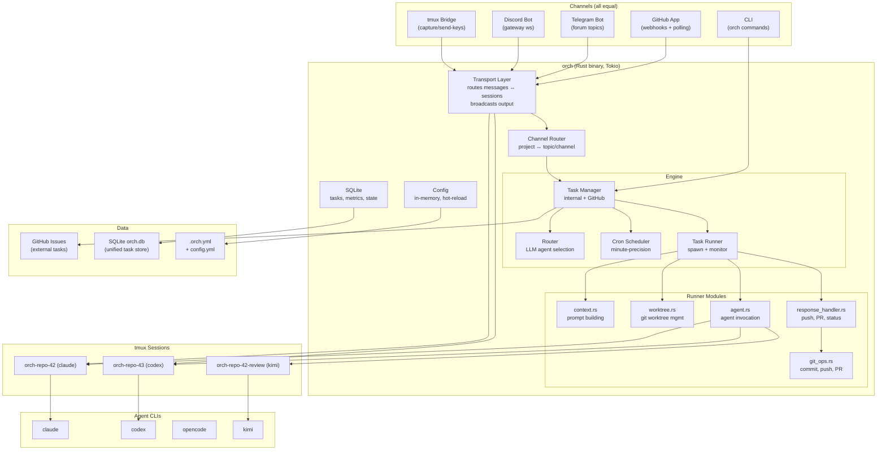
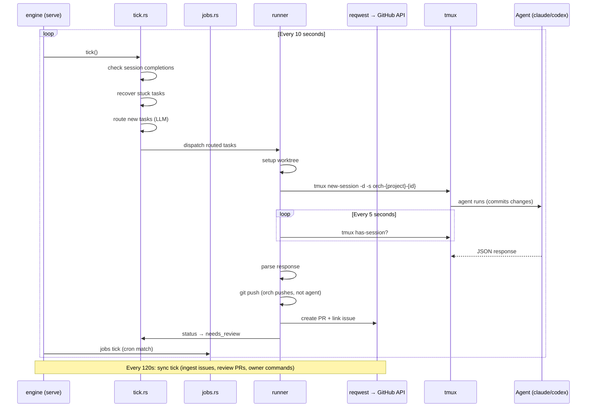
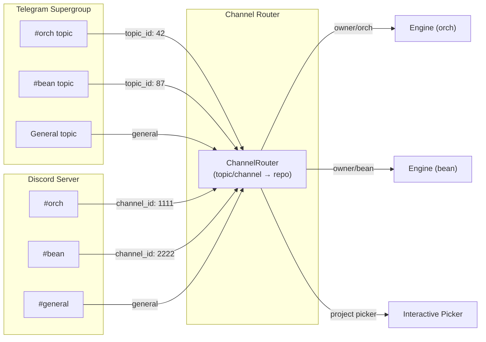

# Orch Architecture

> Communicate with your agents from anywhere — Discord, Telegram, GitHub, or direct tmux attach.

## System Overview



## Process Flow Per Tick



## Task Lifecycle

```
new → routed → in_progress → needs_review → in_review → done
                    │              ▲              │
                    │              │              ├── approve + merge → done
                    │              │              ├── request_changes → routed → ... → needs_review
                    │              │              ├── conflicts/CI/merge fail → needs_review (retry)
                    │              │              └── 3x retry limit → blocked
                    │              └──────────────┘
                    │
                    ├── push failed (1-2x) → routed (different agent)
                    └── push failed (3x) → blocked
```

### Status Semantics

- `new` — task created, waiting for routing
- `routed` — agent and complexity assigned, waiting for dispatch
- `in_progress` — agent running in tmux session
- `needs_review` — PR ready, queued for review agent
- `in_review` — review agent actively working
- `done` — task complete (PR merged or no code changes)
- `blocked` — requires human intervention

### Status Transitions

| Transition | Owner | Location | Trigger |
|---|---|---|---|
| new → routed | engine tick | `engine/tick.rs` | LLM router assigns agent + complexity |
| routed → in_progress | engine dispatch | `engine/tick.rs` | Agent spawned in tmux |
| in_progress → needs_review | runner | `runner/response_handler.rs` | Agent completes + PR exists |
| in_progress → done | runner | `runner/response_handler.rs` | Agent completes, no PR created |
| in_progress → routed | runner | `runner/response_handler.rs` | Push failed (reroute to different agent) |
| in_progress → blocked | runner | `runner/response_handler.rs` | Push failed 3+ times |
| needs_review → in_review | engine tick | `engine/tick.rs` | Review agent spawned |
| in_review → done | engine | `engine/review.rs` | PR approved + merged |
| in_review → routed | engine | `engine/review.rs` | Changes requested → re-dispatch |
| in_review → needs_review | engine | `engine/review.rs` | Review agent failed/crashed |
| in_review → blocked | engine | `engine/review.rs` | Max review cycles, merge failures |

## Responsibility Split

### Agents (commit only)
- Write code, run tests, fix issues
- Commit changes with conventional commit messages
- Report status via JSON output
- Do NOT push, create PRs, or call GitHub write APIs

### Orch Engine (git operations + lifecycle)
- Push branches after agent completes
- Create PRs and link to issues
- Check CI status
- Trigger review agent
- Merge PRs after approval
- Cleanup worktrees and branches
- Route notifications to channels

## Live Session Streaming

```
┌─────────────┐     ┌─────────────┐     ┌─────────────┐
│  Telegram    │     │  Discord    │     │  CLI        │
│  topic #42   │     │  #orch-dev  │     │  orch task  │
│              │     │             │     │  stream 42  │
└──────┬───────┘     └──────┬──────┘     └──────┬──────┘
       │                    │                    │
       ▼                    ▼                    ▼
┌─────────────────────────────────────────────────────┐
│                    Transport                         │
│                                                      │
│  capture-pane (every 2s) ──→ diff ──→ broadcast      │
│  user input ──→ send-keys ──→ tmux session           │
└──────────────────────┬───────────────────────────────┘
                       │
                       ▼
              ┌─────────────────┐
              │  tmux:orch-*-42 │
              │  (claude agent) │
              └─────────────────┘
```

- **Watch** — capture-pane diffs stream to all connected channels in real-time
- **Join** — messages from any channel route to tmux via send-keys
- **Multi-viewer** — multiple channels watch the same session simultaneously

## Channel Routing



- Dedicated channels route messages to their project automatically
- General channel shows a project picker for task creation
- Notifications go to dedicated channels + subscribed channels

## Engine Architecture

```
┌──────────────────────────────────────────────────┐
│ Engine (tokio event loop)                        │
│                                                  │
│  Tick (every 10s):                               │
│    1. Check session completions (tmux poll)      │
│    2. Recover stuck tasks (no session > 10min)   │
│    3. Route new tasks (LLM classification)       │
│    4. Dispatch routed tasks (spawn agents)       │
│    5. Unblock parents (sub-issue check)          │
│    6. Job scheduler (cron matching)              │
│                                                  │
│  Sync (every 120s):                              │
│    - Ingest external tasks (GitHub issues)       │
│    - Review open PRs                             │
│    - Scan for owner commands (/retry, /close)    │
│    - Skills sync (git pull)                      │
│                                                  │
│  Channels:                                       │
│    - Telegram (forum topics, inline keyboards)   │
│    - Discord (multi-channel, button interactions)│
│    - GitHub webhooks (instant events)            │
│    - Tmux capture (output streaming)             │
│                                                  │
│  Shutdown:                                       │
│    - SIGTERM → reset in_progress → routed        │
│    - Tasks re-dispatch into existing worktrees   │
└──────────────────────────────────────────────────┘
```

## Directory Layout

```
~/.orch/
  config.yml             # global config (credentials, engine settings)
  orch.db                # SQLite (tasks, metrics, KV, rate limits, job state, subscriptions)
  projects/              # bare clones added via `orch project add`
  worktrees/             # agent worktrees (all projects)
    repo/branch/         # one per task
  state/                 # runtime state (logs, prompts)
  skills/                # cloned skill repositories
```

## Settled Decisions (DO NOT TOUCH)

- **`src/github/token.rs`** — Token resolution uses `std::process::Command` (blocking, cached 1h). Intentional.
- **`src/engine/runner/`** — Tmux IS the PTY. No external PTY runners.
- **`src/github/auth.rs`** — Deleted (dead code). Do not recreate.
